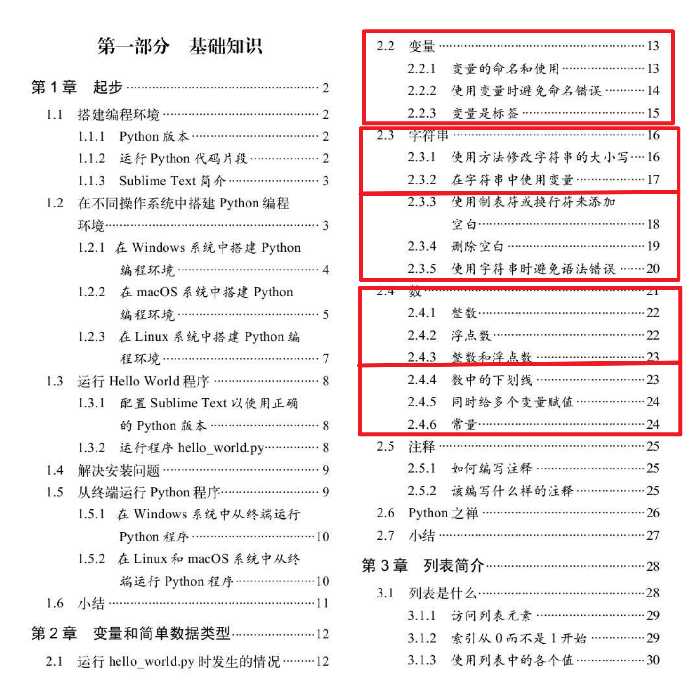

# 写在前面

## 1. 大致进度安排

本书一共分为两个部分, 第一部分是基础学习部分, 第二部分是完成三个小项目

对于前面学习的部分, 我大致看了一下目录, 第一章是环境的搭建和配置, 从第二章开始学习, 我的想法是尽量不占用大家的正常学习时间, 所以每天一个小节吧(小数点一位的, 如 2.2), 遇到 2.3 和 2.4 这种内容比较多的, 可以调整为两天一节, 到了后面可能会有一些抽象的难懂的章节, 可以做适当的调整

我会保持比大家快 1, 2 天的进度, 适时调节一下进度, 我感觉内容也挺少的🐶

到了书的第二部分, 我们一共有三个项目, 分别是

- 游戏
- 数据可视化
- web 应用程序

这部分我也还没接触, 到时候再看😂

## 2. 对大家的要求

1. 要跟上课程进度, 每天在群内打卡学习情况
2. 尽量保证文字记录, 下载一个笔记软件(推荐)或者用 word(不推荐)
3. 除了学习 Python 之外, 还要了解一些计算机方面的内容
4. 学习工具的使用, 比如代码编辑器, 搜索引擎等
5. 遇到问题多讨论多交流

## 3. 好好学习, 天天向上
