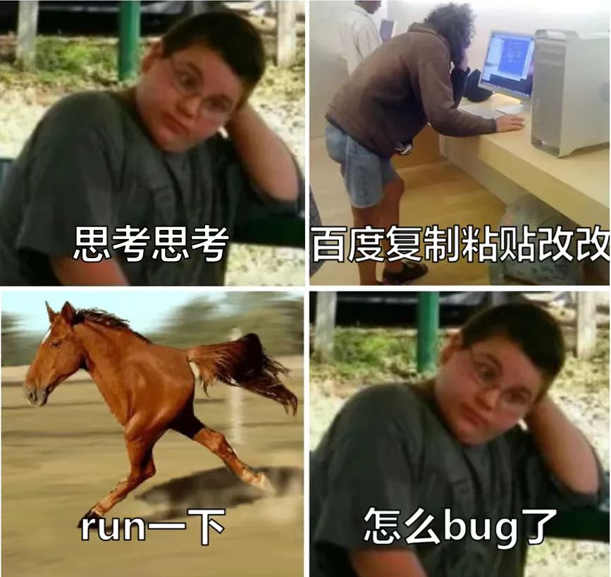
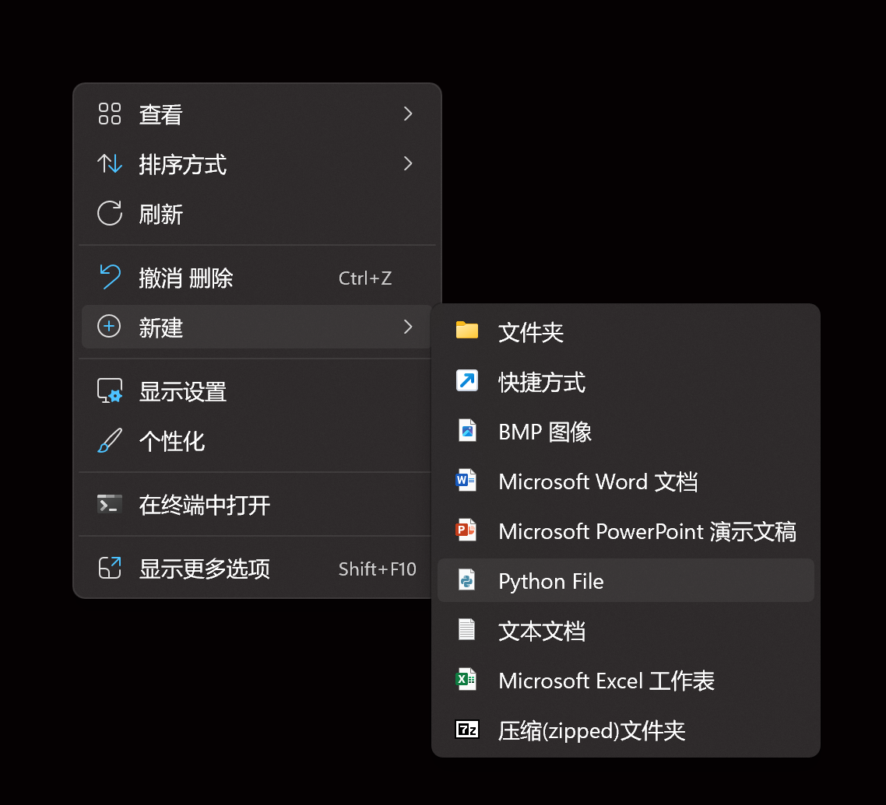

# 环境配置和工具安装

## 1. 一些必须要做的事情

### 1-1 学会组织文件

后面的文件会比较多, 所以要进行文件组织, 我的方法是, 先创建一个 Python 文件夹, 然后按照下面的方式组织

```
python
├── interpreter (这里安装 Python)
├── notes (这里放笔记)
|   ├── 1 (第一章的笔记)
|   ├── 2
|   └── ...
└── files (这里放写的代码)
    ├── 01(第一章的代码)
    |   ├── hello_python.py
    |   └── ...
    ├── 02(第一章的代码)
    └── ...
```

当然也不需要一样, 但是一定要组织好

另外, 所有的名字, 包括文件, 文件夹, 尽量用英文, 否则容易出各种各样的问题

### 1-2 使用 `shift` 切换英文输入法

写代码用英文, 写注释可以用中文

### 1-3 打开文件扩展名

> 什么是文件扩展名
>
> 就是在文件名之后加个后缀, 用来区分不同类型的文件

打开我的电脑, 上面有个查看, 在 `查看 --> 显示` 中勾选 `文件扩展名` 和 `隐藏的项目`

### 1-4 遇到问题, 先问百度


但是也可能出现



还是要有独立的判断

另外, 不推荐用百度, 推荐用 bing(微软出的搜索引擎, 广告少一点, 内容准一点)

### 1-5 学了 Python, 能干什么?

什么都能干🐶, 首先 Python 本身很强, 其次, 编程语言都一样的, 学了 Python 再学其他会容易

## 2. Python 环境配置

1. 首先判断一下自己的电脑中有没有 Python
   1. 按键盘上的 `win`(四个方块块)
   2. 在搜索框中搜索 `cmd`
   3. 打开 `命令提示符`
      - 以上操作之后可能会经常用到
   4. 输入 `python --version`
      - 如果你的电脑有 python, 会显示当前已经安装的 Python 版本
      - 如果之前没有安装过, 会显示 `'python' 不是内部或外部命令，也不是可运行的程序或批处理文件`
2. 下载 Python
   1. 在浏览器中搜索 Python, <mark>进入官网</mark>, (广告很多, 不要点错), 链接 <https://www.python.org/>
   2. 选择 downloads
   3. 下载(默认下载最新版本即可)
3. 安装 Python
   1. 在 `D:/` 盘中单独创建一个文件夹放置 Python 软件
   2. <mark>右键以管理员身份运行 python 的安装包</mark>
   3. <mark>勾选下面 "add Python to PATH"</mark>
   4. <mark>选择 "Customize Inatallation"</mark>
   5. 默认全部勾选, 点击 `next`
   6. 勾选 `install for all users`, <mark>安装位置选择之前创建好的安装包</mark>
4. 检验 Python 安装是否成功
   1. 在 `cmd` 中输入 `python --version`, 判断依据同上

在安装 Python 的同时, 还会安装一个东西叫 pip, 可以先理解为 pip 是一个应用商店, 我们还需要检查一下 pip 是否安装成功

- 在 cmd 中输入 `pip --version`
  - 成功也会显示一个版本
  - 失败显示 `'pip' 不是内部或外部命令，也不是可运行的程序或批处理文件`

至此, Python 的安装就结束了

## 3. 运行第一个程序

### 3-1 交互式(命令行式)

> 交互式很简单, 你让他做什么, 它就做什么, 类似于手机上的语音助手

我们可以在 cmd 中输入 `python` 进入 python 的运行环境, 然后写下并运行第一段 python 代码

python 的运行环境在前面会有一个提示符号 `>>>`, 代码跟在后面写就可以, 注意所有的标点符号都是英文半角

```python
>>> print("Hello, Python")
```

回车

运行结果如下

```python
>>> print("Hello, Python")
Hello, Python
```

### 3-2 写代码式

> 为什么?
>
> > 刚才的交互式适用于比较小型的代码, 但是之后可能会有很多行的代码的程序, 并且对之前的内容要进行反复修改, 保存, 发布, 这时交互式就不够了
> >
> > 所以我们要先把代码写下来, 再"喂"给 Python 解释器运行

1. 我们新建一个Python文件(Python文件的扩展名是 `.py`), 改个英文名

   

2. 然后右键 `打开 --> 打开方式 --> 选择其他应用 --> 记事本`
3. 输入 `print("Hello, Python")`, 保存
4. 复制文件的路径
   - 解释一下路径(path), 电脑中文件很多, 如果全部扫描用得时间很长, 造成资源浪费, 所以你需要告诉 Python 解释器你的文件在哪里
   - 路径分为**相对路径**和**绝对路径**, 上网查一下
   - 路径获取的方式, 选中文件右键 `属性 --> 安全`, 对象名称就是路径, 选中 `ctrl + c` 复制
5. 打开 cmd, 输入 `python {路径}`, 中间有个空格不要忽略
   - 这里的 `{路径}` 替换成文件的路径
   - `{}` 表示替换的这种表述以后我会经常用到
6. 运行成功

其实有个更简单的办法, 直接把文件拖到 cmd 的窗口中, 就会变成他的绝对路径

## 4. 更加简单的办法

之前的两种运行操作又多又烦, 比较原始, 有一种更强大的办法, 叫做 `IDE(intergrate development environment, 集成开发环境)`, 既有交互式, 又有代码式, 操作简单, 功能强大

针对 Python 的 IDE 有很多种, 例如

- PyCharm
- VS Code
- sublime text
- iPython(针对交互式)

我还没想好用哪种, 所以我先睡觉了😂

## 5. 一个小彩蛋

```python
>>> import this
```

试运行一下
